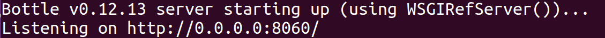

# ReNomTAG

Tagging tool for object detection.

## Install
For installing ReNomTAG, download the repository from following url.

`git clone https://gitlab.com/suwa/ReNomTAG.git`

And move into ReNomTAG directory.
`cd ReNomTAG`

Then install all required packages.

`pip install -r requirements.txt`


## How to start

1.Move to ReNomTAG directory using following command.

`cd ReNomTAG`

2.Run server.py script and the application server starts.

`python server.py`

If the server starts, you will see a message like below.



## How to use

The following videos describes how to use ReNomTAG.
In this video, the Oxford-IIIT Pet Dataset is used.

- Cats and Dogs Classification  
https://github.com/JDonini/Cats_Dogs_Classification

- O. M. Parkhi, A. Vedaldi, A. Zisserman, C. V. Jawahar
Cats and Dogs  
IEEE Conference on Computer Vision and Pattern Recognition, 2012
Bibtex  
http://www.robots.ox.ac.uk/~vgg/data/pets/

#### 1.Set image data to RaNomTAG.
As following video showing, please put the image you want to tag in the `ReNomTAG/dataset` folder.


#### 2.Run ReNomTAG
Same as before mentioned in 'How to start ReNom', following video describes
how to start ReNomTAG.


#### 3.How to use ReNomTAG
It is a video tagging by ReNom tag.


#### 4.Recognize generated xml file.
Xml files are generated into the label directory.


## Format of xml file.

The format of the xml file which created by ReNomTAG follows [PASCAL VOC] format.

An example is bellow.

```
<annotation>
 <folder>
  dataset
 </folder>
 <filename>
  2007_000027.jpg
 </filename>
 <object>
  <pose>
   Unspecified
  </pose>
  <name>
   cat
  </name>
  <truncated>
   0
  </truncated>
  <difficult>
   0
  </difficult>
  <bndbox>
   <ymax>
    203.02013422818794
   </ymax>
   <xmin>
    134.7902328154634
   </xmin>
   <xmax>
    238.81923552543284
   </xmax>
   <ymin>
    104.02684563758389
   </ymin>
  </bndbox>
 </object>
 <source>
  <database>
   Unknown
  </database>
 </source>
 <path>
  dataset/2007_000027.jpg
 </path>
 <segments>
  0
 </segments>
 <size>
  <width>
   486
  </width>
  <height>
   500
  </height>
  <depth>
   3
  </depth>
 </size>
</annotation>
```

## License

“ReNomTAG” is provided by GRID inc., as subscribed software.  By downloading ReNomTAG, you are agreeing to be bound by our ReNom Subscription agreement between you and GRID inc.
To use ReNomTAG for commercial purposes, you must first obtain a paid license. Please contact us or one of our resellers.  If you are an individual wishing to use ReNomTAG for academic, educational and/or product evaluation purposes, you may use ReNomTAG royalty-free.
The ReNom Subscription agreements are subject to change without notice. You agree to be bound by any such revisions. You are responsible for visiting www.renom.jp to determine the latest terms to which you are bound.

[PASCAL VOC]:http://host.robots.ox.ac.uk/pascal/VOC/

