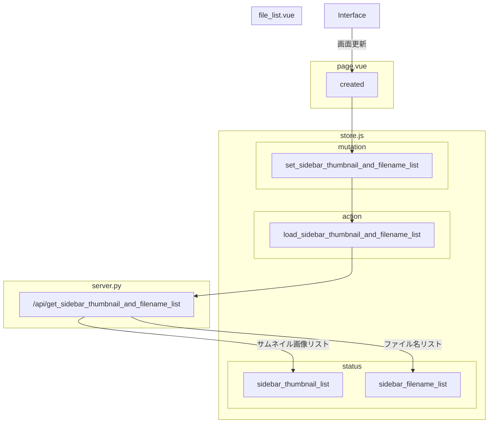

# Data Flow Diagram(DFD)

```mermaid
    graph TD

    Interface-- 画面更新 -->created
    created-->set_sidebar_thumbnail_and_filename_list
    set_sidebar_thumbnail_and_filename_list-->load_sidebar_thumbnail_and_filename_list
    load_sidebar_thumbnail_and_filename_list-->/api/get_sidebar_thumbnail_and_filename_list
    /api/get_sidebar_thumbnail_and_filename_list-- サムネイル画像リスト -->sidebar_thumbnail_list
    /api/get_sidebar_thumbnail_and_filename_list-- ファイル名リスト -->sidebar_filename_list

    subgraph page.vue
      created
    end

    subgraph file_list.vue
      created
    end

    subgraph store.js
      subgraph status
        sidebar_thumbnail_list
        sidebar_filename_list
      end
      subgraph mutation
        set_sidebar_thumbnail_and_filename_list
      end
      subgraph action
        load_sidebar_thumbnail_and_filename_list
      end
    end

    subgraph server.py
      /api/get_sidebar_thumbnail_and_filename_list
    end
```
